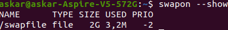
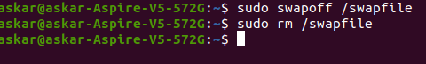
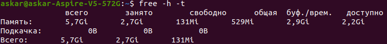
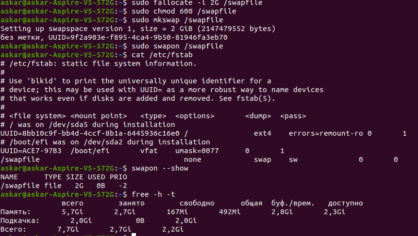
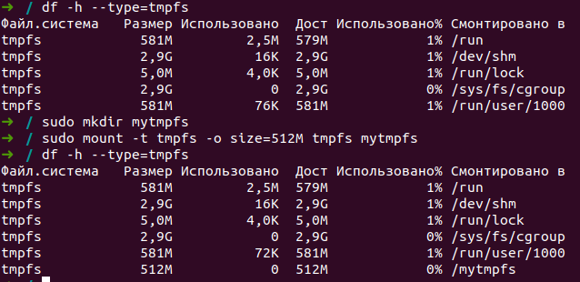
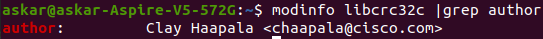

# linux_answers
Ответы на ДЗ по курсу основы Linux

**Задание 1**  
Ответ:  
Deb:  
_Kali Linux_, _Ubuntu_

RedHatPM:  
_Oracle Linux_, _CentOS_

**Задание 2**  
Ответ:  
Команда ps отражает информацию о запущенных процессах. Команда ps чаще всего используется с параметром aux, где a — процессы всех пользователей, u — подробная информация о процессах,  x - это процессы, которые запускаются во время загрузки и работают в фоновом режиме. Далее пайплайн оставить только процессы, запущенные root, далее пайплайн wc -l подсчитает количество строк в переданном ей объекте. Далее запишет в конец файла с названием root в той директории, из которой запущена команда. Если файла не существует, то он создастся.

**Задание 3**  
Ответ:  
_`ps aux | grep root >> user_root_ps`_

**Задание 4**  
Ответ:  
vmstat — команда, выводящая информацию о состоянии памяти, в том числе виртуальной (файл подкачки), соответственно  si, so — swap in,  сколько виртуальной памяти используется с диска (перемещено в реальную из файла подкачки) в секунду, swap out сколько виртуальной памяти возвращается обратно на диск в секунду.

**Задание 5**  
Ответ:  
_`arch`_ или _`uname -m`_ или _`lscpu_ _| grep Architecture`_
_`lscpu | grep name`_ или _`cat /proc/cpuinfo | grep name`_  
  `cat /proc/meminfo | grep Inactive_`

**Задание 6**  

Удаляю файл подкачки:  

Устанавливаю заново: в файл etc/fstab уже была старая строка, я не стал перезаписывать.

**Задание 7**  
Ответ:  
Поскольку  tmpfs это виртуальная файловая система, располагающаяся в оперативной памяти, доступ к файлам осуществляется очень быстро. Это выгодно тем, кто, к примеру, пользуется Linux  с флэшки или карты памяти. Также эта система может использовать файл подкачки. Можно, например, постоянно использующееся приложение разместить именно в этой файловой системе для оперативного доступа и уменьшения износа основного хранилища (жесткого диска). Еще есть один плюс — если пользоваться этой файловой системой, то на жестком диске не остается никаких следов, для тех, кто не любит, когда за ним следят.

**Задание 8**  
Ответ:  
Несомненно влияет, так как этот параметр отражает среднюю нагрузку на оперативную память, процессор и жесткий диск. Соответственно, если операции ввода-вывода влияют на загрузку диска, а они влияют, то и на параметр это тоже влияет.

**Задание 9**  
Ответ:  
Softlink  в отличие от hardlink можно разместить на разных файловых системах относительно исходного файла.  Hard может ссылаться только внутри одного физического пространства (жесткого диска).
	При удалении исходного файла, на который был link, softlink выдаст ошибку и скажет, что такого файла не существует, hardlink же такой ошибки не выдаст и его содержимое будет соответствовать исходному файлу.
	Softlink может ссылаться на директорию, а hardlink нет.

**Задание 10**  
Ответ:  
Увидеть номера инод файлов текущей директории можно командой:
`ls -i` или `stat /директория`
Общее распределение по системе командой `df -hTi` 

**Задание 11**  
Ответ:  
При системном вызове, то есть любой процесс, который вызывают хоть одну системную функцию переходит из пользовательского режима в режим ядра.

**Задание 12**  
Ответ:  

**Задание 13**  
Ответ:  
В порядке убывания количества вызовов rt_sigprocmask, mmap, close, openat, prlimit64.

**Задание 14**  
Ответ:  
Вначале я много гуглил по поводу конкретной описанной ситуации, но ничего подходящего не нашел. Думаю, вопрос в том, будет ли конфликтовать одна система инциализации с той, что запущена в контейнере. Я рискну предположить, что конфликта не будет, ведь на то и контейнеризация, чтобы изолировать то, что происходит в контейнере от того, что происходит в хостовой системе. 
