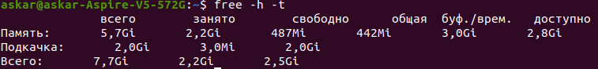

# linux_answers
Ответы на ДЗ по курсу основы Linux

**Задание 1**
Ответ:
Deb:
_Kali Linux_, _Ubuntu_

RedHatPM:
_Oracle Linux_, _CentOS_

**Задание 2**
Ответ:
Команда ps отражает информацию о запущенных процессах. Команда ps чаще всего используется с параметром aux, где a — процессы всех пользователей, u — подробная информация о процессах,  x - это процессы, которые запускаются во время загрузки и работают в фоновом режиме. Далее пайплайн оставить только процессы, запущенные root, далее пайплайн wc -l подсчитает количество строк в переданном ей объекте. Далее запишет в конец файла с названием root в той директории, из которой запущена команда. Если файла не существует, то он создастся.

**Задание 3**
Ответ:
_`ps aux | grep root >> user_root_ps`_

**Задание 4**
Ответ:
vmstat — команда, выводящая информацию о состоянии памяти, в том числе виртуальной (файл подкачки), соответственно  si, so — swap in,  сколько виртуальной памяти используется с диска (перемещено в реальную из файла подкачки) в секунду, swap out сколько виртуальной памяти возвращается обратно на диск в секунду.

**Задание 5**
Ответ:
_`arch`_ или _`uname -m`_ или _`lscpu_ _| grep Architecture`_
_`lscpu | grep name`_ или _`cat /proc/cpuinfo | grep name`_
_`cat /proc/meminfo | grep Inactive_`

**Задание 6**

[//]: # (<image src="Снимок экрана от 2022-04-27 23-00-01.png" alt="Исходное состояние">)

